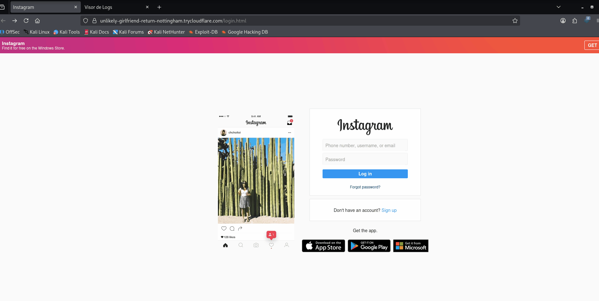

<p align="center">
  
  <strong>Español</strong>
  &nbsp;|&nbsp;
  <a href="README.en.md">
    
    <strong>English</strong>
  </a>
  &nbsp;|&nbsp;
  <a href="https://www.youtube.com/watch?v=xvFZjo5PgG0&list=RDxvFZjo5PgG0&start_radio=1&pp=ygUTcmljayByb2xsaW5nIG5vIGFkc6AHAQ%3D%3D">
    
    <strong>日本語</strong>
  </a>
</p>

# CyInstagramBreaker

CyInstagramBreaker es una herramienta que automatiza el despliegue de un servidor PHP local junto con un túnel público de Cloudflare, permitiendo exponer una página web de forma temporal para pruebas de concienciación en seguridad, auditorías internas y demostraciones educativas.

---

<p align="center">
  
</p

---

## 🎥 Demostración

<p align="center">
  
</p>

---

## Fotos de Herramienta

<h2 align="center">Panel Principal</h2>
<p align="center">
  
</p>

<h2 align="center">Visores Falsos para Victimas</h2>
<p align="center">
  
</p>

<h2 align="center">Viewer Final con Contraseñas de las Victimas</h2>
<p align="center">
  
</p>


## 🚀 Funcionalidades principales

- 🔥 Lanzador automático en Python
- 🌍 Exposición pública mediante Cloudflare Tunnel
- 📡 Detección automática de IP local
- 📊 Panel visor de accesos en tiempo real
- 🧾 Registro de IPs y User-Agents
- 🖥️ Compatible con Linux
- 🧪 Ideal para laboratorios de ciberseguridad

## 🧰 Tecnologías utilizadas

- Cloudflare Tunnel (cloudflared)
- Linux (entorno objetivo)
- Python 3
- PHP
- HTML / CSS

## 📁 Estructura del proyecto

```bash
├── lanzador.py          # Lanzador principal (Python)
├── login.html           # Página de login simulada
├── login.php            # Procesamiento de datos
├── ip.php               # Logger de IPs
├── visor.php            # Visor de registros
├── cloudflared          # Binario de Cloudflare Tunnel
├── index.php            # Página principal
├── index_files/         # Recursos web
├── icono.png
├── DISCLAIMER.md
├── LICENCE
└── README.md
```
---

## 📄 Documentación adicional

- [🤝 Código de Conducta](.github/CODE_OF_CONDUCT.md)
- [📬 Cómo contribuir](.github/CONTRIBUTING.md)
- [🔐 Seguridad](.github/SECURITY.md)
- [⚠️Aviso legal](DISCLAIMER.md)
- [📜 Licencia](LICENSE)
- [📢 Soporte](.github/SUPPORT.md)


---

## ⚙️ 1. Instalación básica con clonado 🐧 Linux 

```bash
git clone https://github.com/cyberiuscompany/CyInstagramBreaker.git
cd CyInstagramBreaker
python3 -m venv venv (No es obligatorio este comando)
source venv/bin/activate (No es obligatorio este comando)
python3 lanzador.py
```

